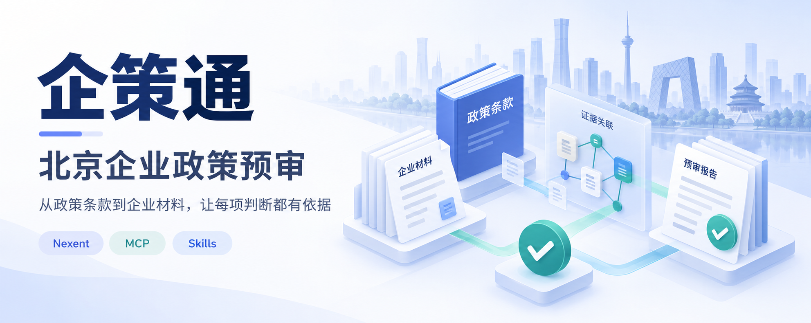
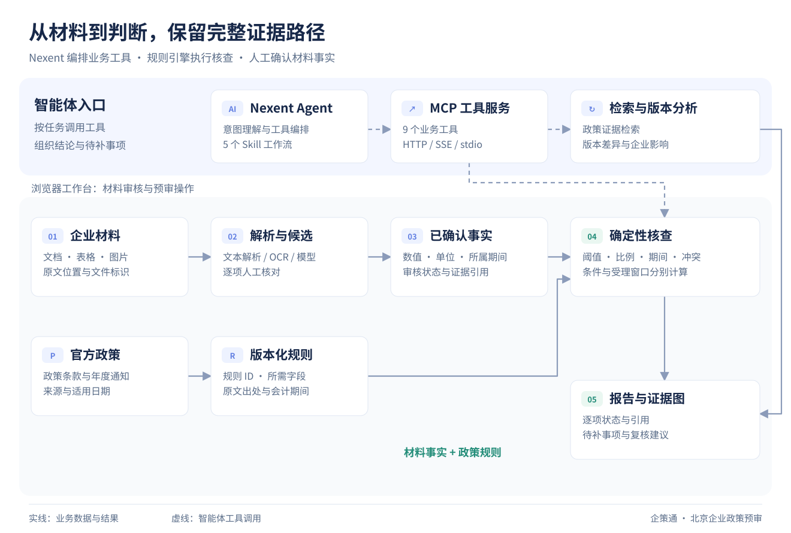
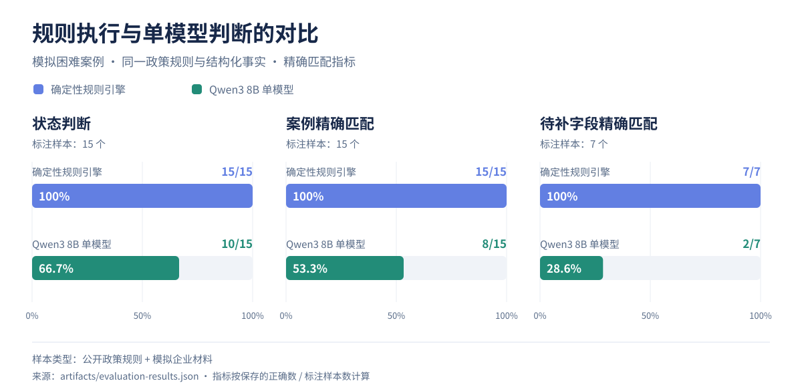

# 企策通 · 北京企业政策预审



个人开源项目：面向北京企业的政策材料预审工作台。把“政策条款 → 企业事实 → 原始材料 → 核查结果”串通，支持 Nexent 智能体通过 MCP 和 Skill 调用。可先独立运行本地规则工作台，再按需接入模型与 Nexent。

## 功能

- 北京科技型中小企业评价、高新技术企业认定两个事项；2025 / 2026 科技型中小企业申报季快照。
- 5 个模拟企业：完整、缺失、规模不满足、冲突、新成立。
- 带材料引用的确定性规则计算；单位归一、资料期间校验、直通车与基础条件分别核查。
- 分别核查申报条件与受理窗口，由规则引擎完成数值判定。
- PDF 文字层、DOCX、XLSX、CSV、TXT 导入、SHA-256 标识、原文定位、人工确认候选。PNG/JPG 可选用本地 OCR 生成待核对草稿。
- 支持兼容 Chat Completions 接口的文字/图片提取，候选经人工确认后进入企业事实库。
- 政策版本差异及企业复核、证据依赖图、Markdown 报告、操作日志。
- 基于 MCP SDK 的 Streamable HTTP / SSE / stdio 服务、9 个工具与 5 个 Nexent Skill ZIP。
- 15 个困难案例和本地 Qwen3 8B 单模型消融；评测中心展示状态准确率、待补字段准确率和耗时。
- 上传政策的数值上限和比例候选提取、现行规则对齐、逐企业影响预览。
- 50 条官方公开拟入库记录的资料不足拒判评测，与模拟困难案例及授权企业案例分开报告。
- 制造业来料抽检模拟模板，复用同一证据规则引擎处理通过、不通过和待补证三种状态。

已完成 Nexent v2.6.0、企策通 MCP、5 个 Skills 和本地 Qwen3 8B 联调，验证了预审、评测、政策变化预览和“检索 → 预审”的工具调用流程。

## 系统流程



规则引擎负责数值、期间与条件计算；Nexent 负责工具编排和解释。材料事实经人工确认进入核查，报告保留条款与材料引用。

## 示例与评测



15 个模拟困难案例中，确定性引擎状态判断为 **15/15**，Qwen3 8B 单模型基线为 **10/15**。另有 50 条官方公开拟入库记录的历史评测，全部在申报材料不足时返回待补证。内置企业和制造业批次均为模拟数据，当前授权企业案例为 0。评测方法、失败案例和数据来源见 [评测说明](docs/evaluation.md) 与 [公开数据说明](docs/public-data-evaluation.md)。

当前检索采用本地词项匹配，概念候选来自种子术语，规则变化提取覆盖明确数值上限和部分比例。工作台核查已编码指标，其余认定条件由业务人员复核，具体项目见 [架构说明](docs/architecture.md)。

## 在当前电脑启动

双击 `START.cmd`，或运行：

```powershell
powershell -NoProfile -ExecutionPolicy Bypass -File .\Start-Qicetong.ps1
```

- 工作台：http://127.0.0.1:8765
- REST API 文档：http://127.0.0.1:8765/docs
- MCP Streamable HTTP：http://127.0.0.1:8767/mcp
- MCP SSE（兼容测试）：http://127.0.0.1:8766/sse
- 数据库、上传原件、运行日志：`runtime/`，不进入版本控制。

若启动失败，查看 `runtime/web.err.log` 与 `runtime/mcp.err.log`。

## 在其他机器安装

实测环境为 Windows / Python 3.14，2026-10-08 已通过 67 项 Python 测试；独立解压的源码包也通过同样的 67 项测试。启动脚本会检查虚拟环境及核心依赖是否可用。

```powershell
py -3.14 -m venv .venv
.\.venv\Scripts\python.exe -m pip install -r requirements.txt
.\.venv\Scripts\python.exe -m uvicorn qicetong.app:app --host 127.0.0.1 --port 8765
# 第二个终端
.\.venv\Scripts\python.exe -m qicetong.mcp_server
```

`requirements.lock.txt` 固定了本机 Windows/Python 3.14 实测版本；其他 Python 版本或系统先使用 `requirements.txt`。浏览器页面不依赖 npm 构建或外部 CDN。

需要离线图片识别时，运行 `.\.venv\Scripts\python.exe -m pip install -r requirements-ocr.txt`。上传 PNG/JPG 后，在材料详情点击“本地 OCR 识别”，打开原图逐项核对并勾选确认，即可采纳候选。模拟图片的识别与浏览器确认流程已通过测试。扫描 PDF 需先逐页转为图片。

Docker 方案：`docker compose up --build -d`。Nexent 的完整本机部署使用 `START-NEXENT.cmd`，详见 `nexent/NEXENT-SETUP.md`。

## 可选模型提取

将 `.env.example` 复制为 `.env`，在本机填写兼容接口的基础地址（通常包含 `/v1`）、文本模型、密钥及可选视觉模型。`.env` 已列入 Git 忽略规则。刷新页面后，在企业材料详情点击“使用模型提取候选”，系统会将所选材料发送到配置的模型服务。

文本候选通过连续原文引用核对后提供确认入口；图片识别结果通过原图逐项核对。无模型服务时，可使用本地 OCR、规则核查和结构化补证流程。

## 一个五分钟演示

1. 工作台选择“星河智研”，对 2026 高企事项执行预审，日期设为 `2026-09-22`。
2. 展开“三年研发费用比例”，查看按金额合计的计算及逐年度材料。
3. 改选“青芽数据”，看到 2024 年研发费用缺失。
4. 在“政策与材料”下载补证示例并上传，将候选确认到“青芽数据”。
5. 回到预审重新执行，查看该项变为已核对满足。旧报告仍保留。
6. 切换科技型中小企业评价，看到“条件满足”与“填报已截止”同时成立。
7. 查看版本演进、证据图并导出报告。

演示使用固定回放日期；日常核查默认使用机器当前日期，受理窗口按所选日期计算。

## 检查与资料

```powershell
.\.venv\Scripts\python.exe -m pytest -q
.\.venv\Scripts\python.exe scripts\fetch_sources.py
.\.venv\Scripts\python.exe scripts\package_skills.py
.\.venv\Scripts\python.exe scripts\evaluate_system.py --with-llm
.\.venv\Scripts\python.exe scripts\evaluate_transfer.py
.\.venv\Scripts\python.exe scripts\smoke_ocr.py
```

公开资料评测仅附历史汇总。要重跑 `scripts/evaluate_public_notice.py`，须先准备未随仓库分发的本地逐条资料，见 `docs/public-data-evaluation.md`。

浏览器端到端测试使用 Playwright + 本机 Edge。`npm install` 后启动独立测试服务（`QCT_RUNTIME` 指向临时目录，例如端口 8879），设置 `QCT_TEST_URL` 并运行 `node tests/browser.cjs`；安装可选 OCR 后再运行 `node tests/browser_ocr.cjs`。独立运行目录将测试数据与日常案例分开。

- `docs/architecture.md`：架构、数据流和业务覆盖。
- `docs/nexent-integration.md`：Nexent 接入说明和联调验收。
- `docs/evaluation.md`：困难案例、单模型消融方法和结果。
- `docs/policy-change-preview.md`：规则候选提取与企业影响预览。
- `docs/manufacturing-transfer.md`：制造业模拟模板及复用测试。
- `docs/release-audit.md`：发布扫描与源码包验证记录。
- `docs/data-publication.md`：公开源码、合成数据、历史汇总和本地材料的范围。
- `docs/github-release.md`：源码打包与 GitHub 发布步骤。
- `artifacts/nexent-agent/qicetong-beijing-agent.zip`：从 Nexent 实例导出的 Agent 与 Skills 包。
- `data/sources.json`：政策来源清单。
- `data/sources/manifest.json`：本机生成的抓取状态、时间和文件哈希，不随公开包分发；新环境获取来源后再生成。
- `nexent/agent-instructions.md`：智能体系统指令。
- `artifacts/nexent-skills/`：可上传技能包。
- `docs/public-data-evaluation.md` 与 `artifacts/public-notice-summary.json`：50 条公示记录的历史汇总、来源与评测任务。
- `data/authorized_case_schema.json` 与 `scripts/validate_authorized_case.py`：脱敏案例格式与机器校验，配合人工授权核验使用。

本地部署默认监听回环地址；团队服务需增加多用户身份认证和访问控制。

## 许可证与公开范围

企策通自研代码、原创文档、合成示例与原创 Skill 使用 [MIT](LICENSE)。许可证使用 `Qicetong contributors` 作为贡献者集合署名。`package.json` 的 `private: true` 仅防止误发布到 npm，不妨碍 GitHub 源码公开。

`nexent/runtime-overlay/agents/` 基于 Nexent v2.6.0 作兼容适配，保留上游 MIT 许可和 NOTICE。第三方组件的许可与归属见 [THIRD_PARTY_NOTICES.md](THIRD_PARTY_NOTICES.md)，源码和数据的分发范围见 [数据范围](docs/data-publication.md)。

运行 `python scripts/build_public_release.py` 生成经过扫描的源码 ZIP 与文件清单。上传步骤见 [GitHub 发布说明](docs/github-release.md)。
