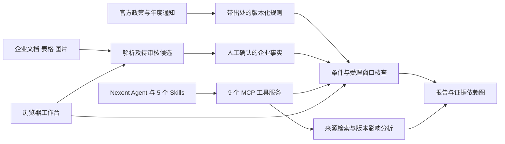

# 架构与证据边界

## 目标

用最小可运行的北京试点验证政策材料预审闭环；不训练基础模型。条件计算以确定性规则完成，模型用于可选的材料理解和 Nexent 工具编排。

## 已实现机制

1. 政策规则具有独立 ID、原文 URL、条款定位、摘要、所需字段和会计期间。
2. 企业事实有 value、unit、period、status 和 evidence 引用。缺失、未确认和冲突不会被当成满足条件。
3. 金额转为 Decimal 计算；元/万元/亿元显式换算；研发比例按三年金额合计计算，阈值由最近一年销售额决定。
4. SME 普通评分与直通车分支分开处理，直通车不免除规模等基础条件。某条可选研发评分路径缺失时，不把它当零分而错误判失败。
5. 企业材料导入仅提出候选。新旧证据不一致时保留冲突；政策概念确认仅扩充概念库，不自动发布规则。
6. 报告保存实际使用的材料与政策证据，并对输入、规则和日期计算 SHA-256。之后改企业资料不改变历史报告。
7. 同一事项的真实版本按年度、日期、字段和期间比较，列出需复核规则并重新核查关联企业。当前执行完整重算，尚未做增量性能优化。
8. 上传政策可提取与现行规则同一条款中的术语、比较词、数值及单位，换算金额后提出变化候选；对每个候选在内存副本中重算企业核查，列出受影响项。上传文件不能直接改写生效规则，必须人工核验权威性和条款上下文。
9. 可选的本地 RapidOCR 对 PNG/JPG 逐行生成文字、图片框位置和候选字段。所有图片候选保持未核验状态，用户打开原图并逐项核对后才能确认；扫描 PDF 尚需先逐页转图。
10. 制造业来料抽检的完全合成模板复用同一事实/规则/证据结构，三种状态均已测试；行业规则本身没有外部权威效力。

## 方案选择

选择“结构化事实 + 规则检查 + 证据依赖图”，原因是当前案例少、关键阈值明确、可逐项验证。纯模型问答难以稳定保证金额、期间和条件边界；全量通用图数据库/图检索栈会增加部署成本，因此初版用 SQLite 保存实体和实际依赖图。

图中边表示出处和判断依赖，不是因果解释。当前“半自动建图”包含种子术语候选、人工对齐、事实审核及受约束的数值规则候选；并非开放式本体发现。规则候选与人工基线的准确率和效率增益尚未独立验证。

## 尚未自动化的业务条件

科技型中小企业的会计核算/税务口径、排除行业完整映射、最新信用记录及现场核验要求；高企的专家创新评分、知识产权核心关联、高新领域实质判断及特殊经营期处理。页面、MCP 和报告均保留这些限制。

## 后续实验

当前先使用15个模拟困难案例比较确定性证据规则引擎与本地 Qwen3 8B 单模型基线，实测方法和边界见 `docs/evaluation.md`。后续仍需由业务人员制作独立的真实脱敏金标准集，包含满足、不满足、缺失、冲突和版本变更案例，继续测量证据定位准确率、人工修正次数、更新处理耗时、模型成本和时延。模拟评测和软件测试都不等于真实企业效果评测。
